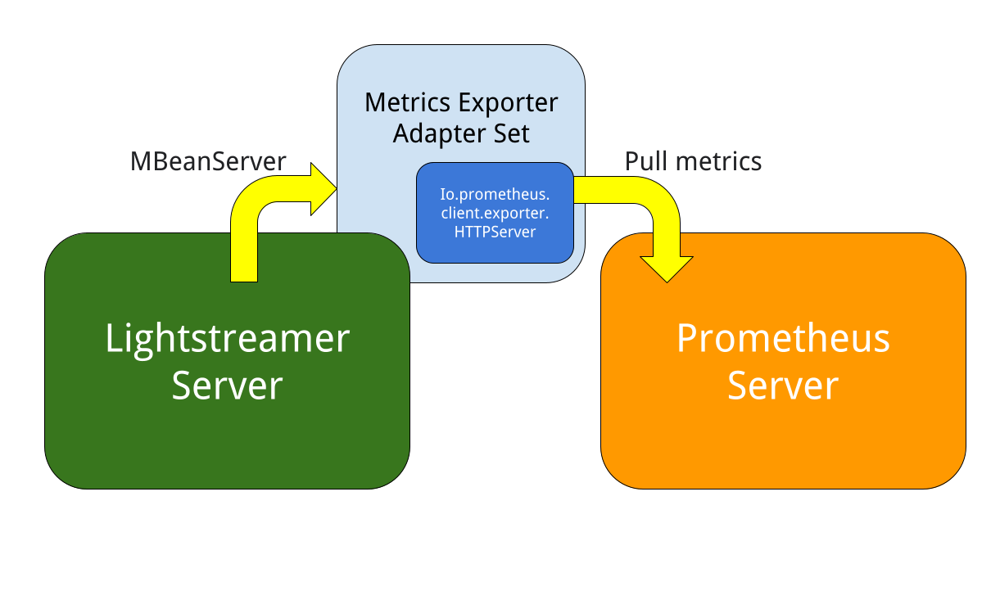

# Lightstreamer Metrics Exporter Adapter Set - Prometheus Integration

This project includes the source code of the Lightstreamer Metrics Exporter Adapter Set. A ready made Adapter Set for fast deployment into
Lightstreamer server an immediate export of numerous metrics for Prometheus monitoring solution out of the box.

This code is designed for Java 8 and greater.

### The Adapter Architecture

This metrics exporter is intended to be run as a Lightsteamer in-proces adapter, exposing a HTTP server and serving metrics of the local JVM.
The code leverages the Prometheus Java Client and include the instrumentation logic into a Metadata Adapter class.

### Configuration

Metrics will be accessible at `http://localhost:<metrics_port>/` or `http://<hostname>:<metrics_port>/` where <hostname> is the hostanme of the machine and <metrics_port> is a configuration parameter 
in the `adapters.xml` file.

## Other GitHub projects using this library

- [Lightstreamer - Reusable Metadata Adapters - Java Remote Adapter ](https://github.com/Lightstreamer/Lightstreamer-example-ReusableMetadata-adapter-java-remote)

## Support

For questions and support please use the [Official Forum](https://forums.lightstreamer.com/). The issue list of this page is **exclusively**
for bug reports and feature requests.

## License

[Apache 2.0](https://opensource.org/licenses/Apache-2.0)
